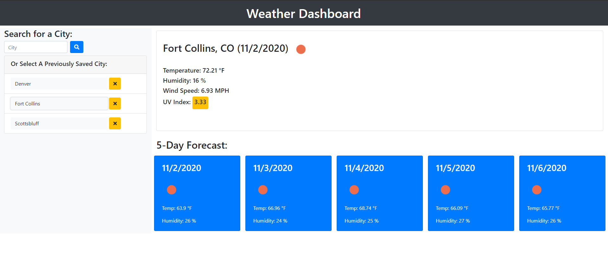

# Weather_Dashboard

DU Full Stack HW 06 Server-Side APIs: Weather Dashboard

## Introduction

For this assignment we were to create a Weather Dashboard where the user could input a city and then the current weather and 5-day forecast for that city would be displayed. In addition, the application should display a list of the previous cities entered and save that list in local memory. The user should be able to select from that list to display the weather for that city again.

## Approach

Utilizing the [OpenWeather API](https://openweathermap.org/api), I wanted to use the OneCall API to get current weather and a 7-day forecast all in one call. However, this required an input of longitude and latitude instead of a city name. To obtain this, I also used the [OpenCage API](https://opencagedata.com/api) which takes a city input and can return the longitude and latitude.

Next, I was concerned that the user might input a city, but not get the actual city they were expecting - for instance, the same city name in a different state. To help catch this, at the top of the page, instead of displaying the city name entered, I displayed the city and state found by the OpenCage API. Then the user can verify that they are seeing the city they expected.

## Improvements

Though not required, I thought it would be nice for the user to be able to clean up their list - delete cities they were no longer interested in or cities that gave the wrong results. To achieve this, I added a delete button next to each item on the city list that removes that name from the list, rebuilds the city list in storage, and rewrites the list to the screen.

## Future Improvements

Another improvement would be to open a list of possible city matches after the user enters their city search - allow them to choose the desired city, and then proceed.

## Results

The application functions well and also looks good on all formats from large screen to a phone.

### Path to GitHub Repository

<https://github.com/JonPointer/Weather_Dashboard>

### Path to GitHub Hosted Application

<https://jonpointer.github.io/Weather_Dashboard/>

### Screenshot of the completed application

